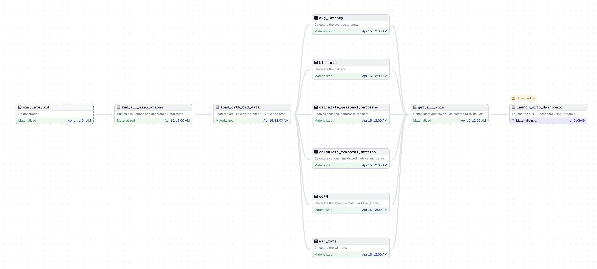
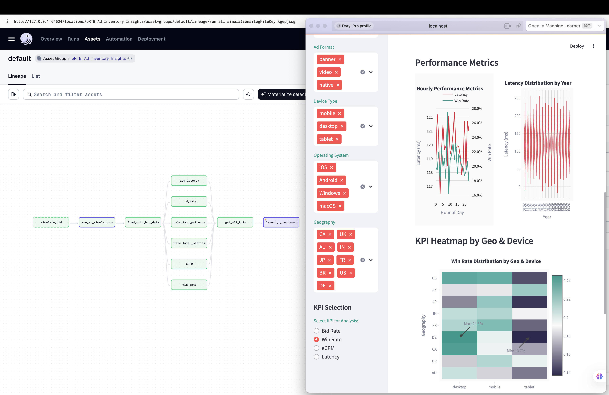

# oRTB Ad Inventory Insights

A comprehensive analytics platform for OpenRTB (Real-Time Bidding) ad inventory data, providing insights, KPI tracking, and interactive visualizations.

## Project Overview

oRTB Ad Inventory Insights is a data analytics tool designed to help ad tech professionals analyze and visualize real-time bidding performance metrics. The platform processes OpenRTB bid stream data to calculate key performance indicators, identify trends, and visualize insights through an interactive dashboard.

## Features

- **Data Processing Pipeline**: Built with Dagster for reliable and scalable data orchestration
- **KPI Calculation**: Automated computation of critical RTB metrics including:
  - Bid Rate
  - Win Rate
  - eCPM (effective Cost Per Mille)
  - Response Latency
- **Temporal Analysis**: Time-series analysis of bidding patterns with year-over-year and month-over-month comparisons
- **Interactive Dashboard**: Streamlit-powered visualization dashboard with:
  - Real-time filtering by date, ad format, device type, OS, and geography
  - KPI trend visualizations
  - Device and geography distribution charts
  - Performance metrics by hour
  - Heatmap analysis of KPIs by geo and device
- **Data Simulation**: Built-in capability to generate realistic RTB traffic data for testing and development

## Dagster Pipeline Workflow

The data processing pipeline uses Dagster for workflow orchestration:


*Initial state of Dagster UI showing unmaterialized assets*


*Dagster UI after successful materialization of all assets*

## Interactive Dashboard

After materializing all assets, the interactive dashboard provides comprehensive visualization capabilities:


*The Streamlit dashboard with visualized RTB metrics*

## Installation

### Prerequisites

- Python 3.9+
- pip or conda for package management

### Setup

1. Clone the repository
   ```bash
   git clone https://github.com/Darylwanji/oRTB-Ad-Inventory-Insights.git
   cd oRTB-Ad-Inventory-Insights
   ```

2. Create and activate a virtual environment (optional but recommended)
   ```bash
   python -m venv oRTB-env
   source oRTB-env/bin/activate  # On Windows: oRTB-env\Scripts\activate
   ```

3. Install the required packages
   ```bash
   pip install -e ".[dev]"
   pip install plotly  # Required for visualizations
   pip install streamlit  # Required for dashboard
   ```

## Usage

### Running the Dagster Pipeline

1. Start the Dagster development server
   ```bash
   dagster dev
   ```

2. Open your browser and navigate to the URL displayed in the terminal (typically http://localhost:3000)

3. From the Dagster UI, you can:
   - Run the full pipeline to generate and analyze RTB data
   - Execute individual assets to update specific metrics
   - Monitor the execution status and logs

### Launching the Dashboard

The dashboard can be launched either:

1. Through Dagster by running the `launch_ortb_dashboard` asset, or

2. Directly from the command line:
   ```bash
   python -m oRTB_Ad_Inventory_Insights.Assets.ortb_dashboard
   ```

The dashboard provides an interactive interface to:
- Filter data by date range, ad format, device type, OS, and geography
- View key performance metrics (Bid Rate, Win Rate, eCPM, Latency)
- Analyze trends over time
- Explore performance across different segments

## Project Structure

```
oRTB-Ad-Inventory-Insights/
├── oRTB_Ad_Inventory_Insights/        # Main package directory
│   ├── Assets/                        # Dagster assets and data processors
│   │   ├── simulate_ortb_traffic.py   # RTB data simulation
│   │   ├── ortb_kpis.py               # KPI calculation assets
│   │   ├── ortb_dashboard.py          # Streamlit dashboard
│   │   └── constants.py               # Shared constants and config
│   ├── Data/                          # Data storage directory
│   └── definitions.py                 # Dagster definitions
├── oRTB_Ad_Inventory_Insights_tests/  # Test directory
│   └── test_assets.py                 # Asset tests
├── pyproject.toml                     # Project configuration
├── setup.py                           # Setup script
└── README.md                          # This file
```

## License

This project is licensed under the terms included in the LICENSE file.

## Contributing

Contributions are welcome! Please feel free to submit pull requests or open issues to improve the project.

